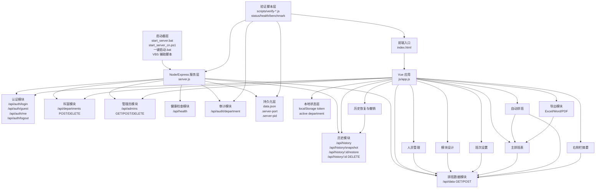

# 项目模块连接拓扑与全链路循环核验报告

- 生成时间: 2026-05-18
- 项目根目录: `c:\Users\94725\Desktop\paiban`
- 核验范围: 启动器、前端界面、认证、科室、模块设计、人员、班次、排班、自动排班、右侧栏摘要、历史恢复、管理员、导出、持久化、验证脚本
- 本轮结论: 核心功能模块连接链路可用，`22/22` 条回归验证全部通过；未发现阻断级模块断链问题

## 1. 模块连接拓扑图

## 2. 功能模块与依赖关系

| 模块 | 入口文件 | 主要依赖 | 上游输入 | 下游输出 |
| --- | --- | --- | --- | --- |
| 启动器 | `start_server.bat` / `start_server_cn.ps1` | Node、PowerShell、VBS、`.server-port`、`.server-pid` | 用户菜单选择 | 启停服务、打开浏览器、状态检查 |
| 前端入口 | `index.html` | Vue、Tailwind、本地 vendor 包 | 浏览器访问 | 渲染 UI、挂载 Vue 应用 |
| 会话认证 | `js/app.js` + `server.js` | `localStorage`、`sessions` | 登录/游客登录 | token、角色态、权限控制 |
| 科室管理 | `js/app.js` + `/api/departments` | 当前科室、排班数据 | 新建/复制/删除科室 | 新科室、切换回退科室 |
| 模块设计 | `js/app.js` + `/api/data` | `modules`、`doctors`、`shiftTypes`、`scheduleData` | 创建/停用/删除/排序模块 | 模块配置、连带清理医生/班次/排班 |
| 人员管理 | `js/app.js` + `/api/data` | `enabledModules`、`doctors` | 新增/编辑/删除/排序人员 | 更新医生列表与排班引用 |
| 班次设置 | `js/app.js` + `/api/data` | `shiftTypes`、模块分类 | 新增/编辑/删除班次 | 更新班次定义与排班引用 |
| 主排班表 | `js/app.js` + `/api/data` | `scheduleData`、`shiftTypes`、`doctors` | 点击单元格排班 | 更新日程数据、驱动右侧栏 |
| 自动排班 | `js/app.js` | `enabledDoctors`、`getAvailableShifts()`、`scheduleData` | 个人/整组排班配置 | 批量写入排班 |
| 右侧栏摘要 | `js/app.js` | `scheduleData`、`doctorMap`、`moduleMap` | 选定日期、模块侧栏规则 | 当日排班人员汇总展示 |
| 历史快照 | `js/app.js` + `/api/history*` | `scheduleHistory` | 手动留存、恢复、删除、撤销清空 | 快照记录、恢复前自动留存 |
| 管理员管理 | `js/app.js` + `/api/admins` | 终端管理员权限 | 新增/删除管理员 | 管理员账号列表 |
| 导出 | `js/app.js` + `xlsx/html2pdf` | 当前视图数据、权限 | Excel/Word/PDF 导出 | 文件下载 |
| 审计接口 | `server.js` + `/api/audit/department` | `getSchedulablePayload()`、`scheduleHistory` | 审计脚本、清理脚本 | 科室摘要、业务载荷、历史快照明细 |
| 持久化 | `server.js` | `data.json` | 业务写入 | 规范化后的部门级数据 |
| 验证脚本 | `scripts/*.js` | HTTP、Puppeteer、结果 JSON | API/浏览器自动化 | 回归产物与汇总报告 |

## 3. 核心接口与交互路径

### 3.1 认证链路

1. 页面挂载后，前端执行 `restoreSession()`
2. 若已有 token，调用 `/api/auth/me`
3. 若无 token 或 token 失效，调用 `/api/auth/guest`
4. 认证成功后调用 `/api/data` 拉取当前科室完整业务数据
5. 角色态驱动 `canEditData` / `canManageAdmins`，控制后续模块入口

### 3.2 数据主链路

1. 前端所有业务状态汇总为 `modules / doctors / scheduleData / shiftTypes / notices / uiSettings`
2. `watch()` 监听上述状态
3. 触发 `debouncedSaveData()`
4. 调用 `/api/data`
5. 后端执行 `normalizeDepartment()` 与持久化
6. 若内容变化且未显式跳过，则自动生成历史快照

### 3.3 科室切换链路

1. 头部科室选择器触发 `switchDepartment()`
2. 前端关闭当前管理弹层与排班弹窗
3. 调用 `/api/data?departmentId=...`
4. 返回目标科室的模块、人员、班次、排班、通知、UI 配置
5. 本地状态整体切换，后续所有模块都基于该科室重新工作

### 3.4 模块设计链路

1. 打开“模块设计”进入模块管理器
2. 创建模块时仅写前端状态，随后由自动保存链路提交 `/api/data`
3. 停用模块时保留关联人员、班次、排班，但从主界面与自动排班候选中移除
4. 删除模块时同步清理:
   - 该模块下人员
   - 该模块下仅归属本模块的班次
   - 相关排班记录
   - 自动排班、筛选器、弹窗中的失效引用

### 3.5 排班与自动排班链路

1. 主排班表单元格点击后打开班次弹窗
2. `getAvailableShifts()` 按模块启用状态、节假日限制、班次适用分类过滤
3. `assignShift()` / `addShiftEntry()` 执行规则校验:
   - 节假日白班限制
   - 一线值班不能连续两天
   - 单模块是否允许多班次叠加
4. 自动排班通过 `generateAutoSchedule()` 批量写入 `scheduleData`
5. 保存后右侧栏摘要与导出模块同步消费同一份排班数据

### 3.6 历史与撤销链路

1. 打开历史面板调用 `/api/history`
2. 手动留存调用 `/api/history/snapshot`
3. 恢复历史调用 `/api/history/:id/restore`
4. 清空类操作先留存快照，再执行业务清空，再支持“撤销最近一次清空”

### 3.7 审计与清理链路

1. 审计脚本登录管理员账号后调用 `/api/data` 获取科室列表
2. 按科室调用 `/api/audit/department?departmentId=...`
3. 后端一次性返回:
   - 科室摘要
   - 当前业务载荷
   - 历史快照摘要与明细
4. 清理脚本基于该响应识别测试残留并调用 `/api/data`、`/api/history/:id`
5. 审计与清理逻辑已不再依赖直接读取本地 `data.json`

## 4. 本轮循环核验覆盖

### 4.1 自动化核验步骤

- 启动状态检查: `status-check`
- 健康检查: `health-check`
- 本地性能基线: `benchmark-local`
- 浏览器启动运行态: `verify-start-browser-runtime`
- 权限边界: `verify-role-boundaries`
- 导出权限 UI: `verify-export-permissions-ui`
- 模块设计操作: `verify-module-actions-ui`
- 停用模块右侧栏过滤: `verify-disabled-module-sidebar`
- 右侧栏规则验证:
  - `verify-custom-module-sidebar`
  - `verify-module-sidebar-advanced`
  - `verify-module-sidebar-advanced-display`
  - `verify-module-sidebar-badge-hierarchy`
  - `verify-module-sidebar-count-mode`
  - `verify-module-sidebar-density`
  - `verify-module-sidebar-empty-state`
  - `verify-module-sidebar-mode-whitelist`
  - `verify-module-sidebar-mode-keyword`
  - `verify-module-sidebar-phone-display-mode`
  - `verify-module-sidebar-title-mode`
  - `verify-module-sidebar-visual`
  - `verify-sidebar-label-order`
- 头部布局: `verify-header-layout`

### 4.2 核验结果

- 最新汇总: `22/22` 通过
- 最新汇总文件: `full_e2e_suite_report.json`
- 最新稳定性报告: `STABILITY_REPORT.md`
- 本轮未发现阻断级模块断链、数据写入中断或恢复失败问题

## 5. 异常问题记录

### 5.1 阻断级异常

- 本轮业务循环核验中未发现阻断级异常

### 5.2 非阻断观察项

1. 巡检入口前置依赖已收口
   - 原现象: 服务未先启动时，`status-check` 会因缺少 `.server-port` 直接失败
   - 处理结果: `run-full-e2e-suite.ps1` 已增加“自动启动服务 + 等待健康检查通过”的前置包装
   - 当前状态: 已修复，不再作为残留风险

2. 前端控制台仍存在开发构建告警
   - 现象: 浏览器运行态验证里仍记录 Vue/Tailwind 的开发版提示
   - 影响节点: 前端入口 -> 浏览器运行态
   - 影响范围: 不影响功能，但会降低生产环境整洁度
   - 建议: 发布场景切换到生产版 Vue 与 Tailwind 构建产物

3. 审计侧旁路依赖已收口
   - 原现象: 审计/清理脚本需要额外读取本地 `data.json` 才能拿到历史快照明细
   - 处理结果: 后端已新增 `/api/audit/department`，统一返回 `department + scheduleHistory`
   - 当前状态: 已修复，清理脚本已切换到新接口

## 6. 稳定性判断

### 6.1 模块连接稳定性

- 启动器 -> 服务进程: 正常
- 前端 -> 认证接口: 正常
- 前端 -> 排班数据接口: 正常
- 模块设计 -> 数据保存 -> 持久化: 正常
- 自动排班 -> 排班表 -> 右侧栏摘要: 正常
- 历史恢复 -> 主数据回滚 -> 页面刷新: 正常
- 终端管理员 -> 管理员接口: 正常
- 游客/普通管理员 -> 权限边界拦截: 正常

### 6.2 数据一致性

- 模块停用后，自动排班与右侧栏均不会继续读取停用模块医生
- 模块删除后，关联医生、班次、排班引用会同步清理
- 普通管理员修改业务数据后可正确回读
- 历史恢复后数据可回滚到预期状态
- 清理脚本已能清除测试残留的正式数据与历史快照

## 7. 针对性修复建议

1. 生产资源收敛
   - 将当前开发版 Vue/Tailwind 本地包切换到生产版，清除运行态告警

2. 导出内容深度校验
   - 新增导出文件内容对比脚本，不仅验证按钮与权限，也校验导出结构、表头、班次文本是否正确

3. 启动器核验集成
   - 把启动器性能优化结果纳入巡检报告，形成“服务启动耗时 / 停止耗时 / 浏览器打开耗时”的专项指标

## 8. 最终结论

- 当前项目的主要功能模块之间连接关系清晰，前后端主链路完整，跨模块交互在本轮循环核验中均能闭环。
- 已验证通过的重点包括认证、科室切换、模块设计、人员与班次维护、排班写入、自动排班、右侧栏联动、历史恢复、权限控制与导出入口。
- 当前未发现需要立刻修复的阻断级连接异常；已完成巡检入口自动起服与审计只读接口增强，后续建议优先推进生产资源构建收敛与导出内容深度校验。
